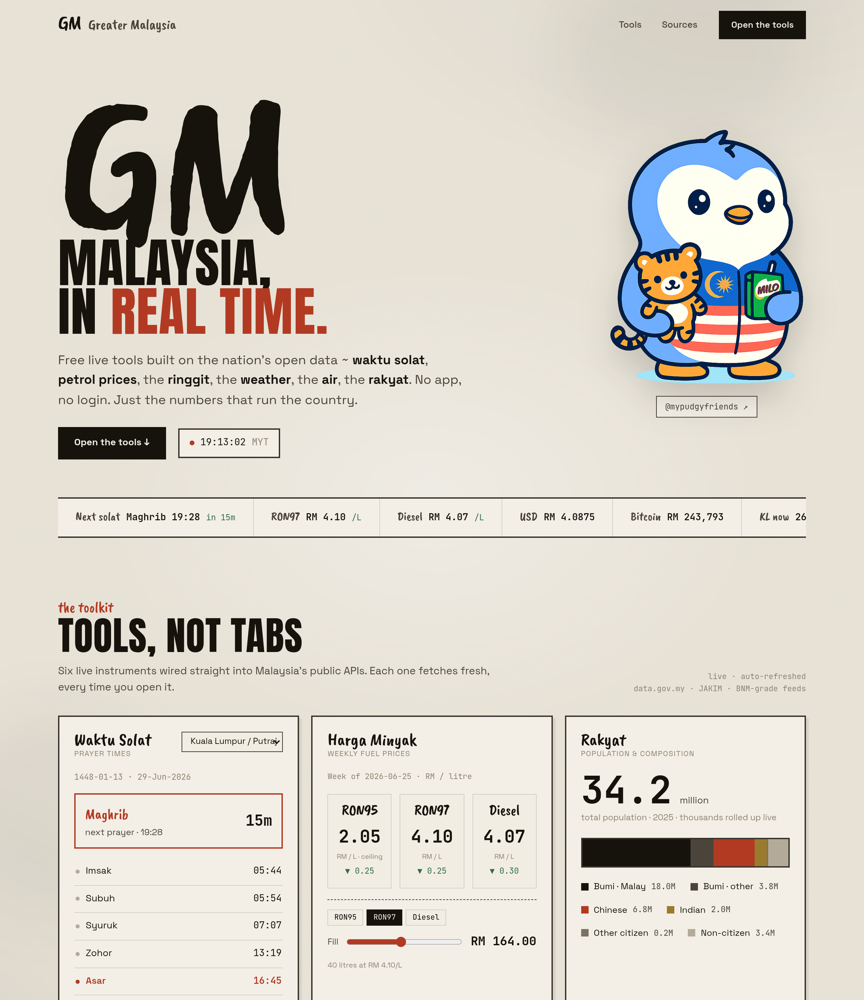
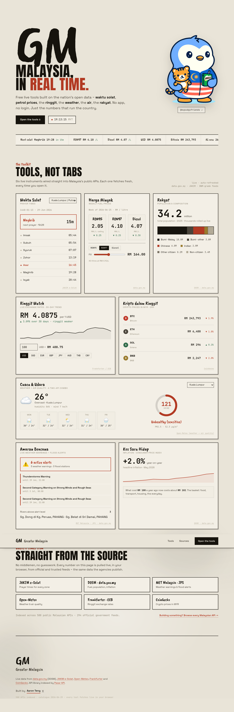

# Greater Malaysia

**The nation, in real time.** A suite of free, live tools for everyday Malaysians — prayer times, petrol prices, the ringgit, the weather, the air, disaster warnings and the cost of living — all pulled straight from official open data, in the browser, with no login.

[](https://greatermalaysia.com)
[](#tech)
[](#how-it-works)
[](LICENSE)

### → **[greatermalaysia.com](https://greatermalaysia.com)**



---

## The idea

Most "API" sites show you the *ingredients* — endpoints, auth schemes, a catalogue of 500+ APIs only a developer could love. **Greater Malaysia shows you the dishes.** Every panel is a finished, useful thing an ordinary person actually opens their phone for, built on top of those same public feeds. The data is the means; the tool is the point.

It's designed for the Malaysian who lands here from a Google search or an AI chat — not for builders.

## The tools

| Tool | What it does | Source |
|------|--------------|--------|
| 🕌 **Waktu Solat** | Prayer times for any zone + live countdown to the next prayer | JAKIM e-Solat |
| ⛽ **Harga Minyak** | Weekly RON95 / RON97 / Diesel prices + a *fill-your-tank* calculator | DOSM · data.gov.my |
| 👥 **Rakyat** | Population (34.2M) with live ethnic composition | DOSM · data.gov.my |
| 💱 **Ringgit Watch** | Live exchange rates, 30-day trend, and a money converter | Frankfurter / ECB |
| ₿ **Kripto dalam Ringgit** | BTC / ETH / SOL / BNB priced in MYR, 24h change | CoinGecko |
| 🌦 **Cuaca & Udara** | Weather + 5-day forecast **and** air quality (US AQI), 8 cities | Open-Meteo |
| ⚠️ **Amaran Bencana** | Live MET weather warnings + rivers above flood-alert level | MET Malaysia · JPS |
| 📈 **Kos Sara Hidup** | Headline inflation (YoY) with a plain-language takeaway | DOSM · data.gov.my |

Plus a live **ticker** that stitches every feed into one scrolling line at the top.

## How it works

No backend, no API keys, no build step. The whole thing is three static files that fetch **live, public, CORS-friendly APIs directly from the browser** — so it deploys anywhere and costs nothing to run.

A few engineering details I cared about:

- **Staggered + retried fetches** — ~10 feeds load on boot, so they're spaced out by host with exponential-backoff retries to respect rate limits (CoinGecko especially) and survive transient failures.
- **Every tool degrades on its own** — one feed failing never takes down the page; each panel shows its own quiet error state.
- **Interactive combos** — the fuel tool drives a litres→ringgit calculator; the FX tool is a live converter; "Cuaca & Udara" merges two separate Open-Meteo APIs into one panel.
- **Honest data** — RON95 is shown at its subsidised ceiling (it doesn't float), and I deliberately *dropped* a public-holidays tool rather than hardcode lunar dates that might be wrong, because the whole pitch is accuracy.
- **Accessible & responsive** — single-column on mobile, `prefers-reduced-motion` respected, semantic markup.

## Tech

- **Vanilla HTML / CSS / JavaScript** — no framework, no bundler
- Hand-built SVG charts (sparklines, donut gauges, composition bars)
- Type: [Anton](https://fonts.google.com/specimen/Anton) · [Caveat Brush](https://fonts.google.com/specimen/Caveat+Brush) · [Space Grotesk](https://fonts.google.com/specimen/Space+Grotesk) · [JetBrains Mono](https://fonts.google.com/specimen/JetBrains+Mono)
- A brush-ink-on-paper design system (a small, themeable set of CSS custom properties)
- **Deployed on Vercel**, custom domain, GA4 analytics

## Data sources

All public and free:

- [data.gov.my](https://data.gov.my) (DOSM) — fuel, population, inflation, weather warnings, flood
- [JAKIM e-Solat](https://www.e-solat.gov.my) — prayer times
- [Open-Meteo](https://open-meteo.com) — weather & air quality
- [Frankfurter](https://frankfurter.dev) (ECB) — exchange rates
- [CoinGecko](https://www.coingecko.com) — crypto prices
- API landscape indexed by [Pasar API](https://pasarapi.krackeddevs.com) (KrackedDevs)

## Run locally

No dependencies — just serve the folder:

```bash
git clone https://github.com/asianpengu/greater-malaysia.git
cd greater-malaysia
python3 -m http.server 4178
# open http://localhost:4178
```

The tools fetch live data, so they update every time you load.

## Verify before shipping

Everything runs on Node's built-in test runner — no test dependencies.

```bash
npm test        # all unit + integration tests (tests/*.test.mjs, scripts/i18n/*)
npm run check   # npm test + 168-page trilingual structural verification + internal link check
```

A failed step exits non-zero, so `npm run check` is the release gate. Run it
from a clean checkout before deploying.

## Shared interfaces

- `jgetMeta(url, retries, ttl, {persistent, maxStaleMs})` in `common.js` —
  fetch JSON with metadata: `{value, fetchedAt, cacheState: "network"|"session"|"stale", stale}`.
  With `persistent: true` the last good value is kept in `localStorage`
  (`gm:last:v1:<url>`) and served only after every retry fails and only
  within `maxStaleMs`. `jget()` still returns raw JSON for existing callers.
- `getPrefs()` / `setPrefs(patch)` / `clearPrefs()` in `common.js` — no-login
  local preferences under the versioned key `gm:prefs:v1` (`{city, state}`,
  validated against `GM_CITIES` and `GM_STATE_CODES`).
- `window.GM_SHARE_PAYLOAD()` — optional page hook read at click time by the
  share row; returns `{title, text, url, personalized}` or null to fall back
  to page metadata. `/today` and `/cuti-planner` publish result-aware payloads.
- `cuti-engine.mjs` — pure `buildOpportunities({year, holidays, weekendDays})`
  and `optimizePlan({opportunities, leaveBudget})`; `cuti-url.mjs` — planner
  URL params + share/analytics builders; `cuti-calendar.mjs` — RFC 5545
  export. `data/public-holidays-2026.json` is the source-cited 16-jurisdiction
  holiday dataset behind `/api/holidays?state=`.
- GA4 events: `live_card_result`, `share_click`, `preference_set`,
  `retry_click`, `cuti_plan`, `calendar_export` — bounded parameters only.

## Maintenance

**Data stories are pre-rendered.** The `stories/*.html` pages have their full
content and JSON-LD schema baked into the HTML (so AI/search crawlers that
don't run JS still see everything). After editing any `data/*.json` story file
— or the render markup in `stories/story.js` / `scripts/prerender-stories.mjs`
(they mirror each other) — re-run:

```bash
node scripts/prerender-stories.mjs
```

**Yearly rollover.** `/cuti-umum` is a stable redirect (see `vercel.json`)
currently pointing at `cuti-umum-2026.html`. When the 2027 holiday list is
gazetted, create `cuti-umum-2027.html` and repoint the redirect (there's a
TODO at the top of the 2026 page).

**Shared JS.** `common.js` holds the helpers ($, esc, fmt, jget with
timeout + sessionStorage cache, sparkline, wireNav, toast…) used by `app.js`,
`today.js`, `answer.js` and `stories/story.js` — load it first on any new page.
Follow-up idea: the HTML page chrome (nav / footer / gtag snippet) is still
copy-pasted per page and could be generated from a template at build time.

## Full walkthrough

<details>
<summary>See the whole page (all 8 tools)</summary>



</details>

## License

[MIT](LICENSE) — use it, fork it, build your own city's version.

---

Built by **[Aaron Teng](https://x.com/aaronteng)** 𝕏 — a one-stop, real-time window into Malaysia.
